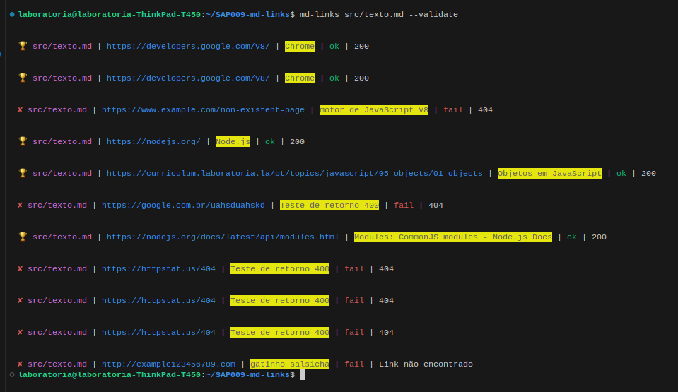
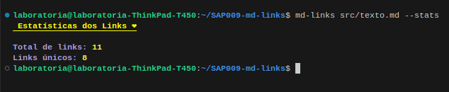
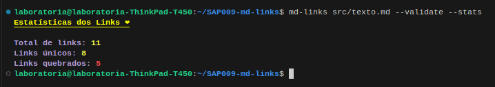
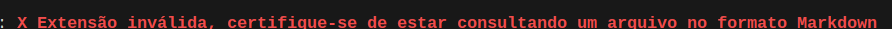
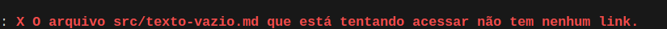

# Markdown Links

## Índice

- [Markdown Links](#markdown-links)
  - [Índice](#índice)
  - [1. Sobre o projeto](#1-sobre-o-projeto)
  - [2. Funcionalidades](#2-funcionalidades)
  - [3. Instruções de Uso](#3-instruções-de-uso)
  - [4. Considerações técnicas](#4-considerações-técnicas)
  - [5. Testes Unitários](#5-testes-unitários)
  - [6. Testes de Usabilidade](#6-testes-de-usabilidade)

---

## 1. Sobre o projeto

Este projeto consiste em uma ferramenta de linha de comando (CLI) que permite aos usuários executarem a biblioteca diretamente do terminal. O objetivo principal da biblioteca é analisar arquivos Markdown usando um módulo do Node.js.

A CLI apresenta os links encontrados nos arquivos, exibindo informações como a rota do arquivo em que o link foi encontrado, a URL encontrada e o texto dentro do link. Além disso, a ferramenta oferece recursos de validação dos links e geração de estatísticas relacionadas a eles.

O desenvolvimento do projeto ocorreu em quatro etapas (sprints), seguindo um planejamento prévio baseado em um fluxograma e detalhamento das tarefas no Trello.

Essa aplicação visa proporcionar uma maneira conveniente e eficiente de analisar links em arquivos Markdown, facilitando a verificação de sua existência, validade e fornecendo informações úteis aos usuários.

Sinta-se à vontade para perguntar se você tiver mais dúvidas ou se precisar de informações adicionais.

## 2. Funcionalidades

`Listagem de links:`

- Exibe os links encontrados nos arquivos Markdown.
- Mostra a rota do arquivo onde o link foi encontrado, a URL encontrada e o texto dentro do link.

`Validação de links:`

- Verifica se os links encontrados nos arquivos Markdown estão funcionando corretamente.
- Retorna o código de status HTTP da URL correspondente.
- Exibe mensagens indicando o resultado da validação, com "fail" em caso de falha e "ok" em caso de sucesso.

`Estatísticas de links:`

- Exibe informações estatísticas sobre os links encontrados.
- Mostra o número total de links encontrados.
- Apresenta o total de links únicos.
- Mostra o número de links que estão funcionando corretamente.

## 3. Instruções de Uso

Para instalar o módulo, execute o seguinte comando:
`npm install md-links-ariane-vieira`

#### Interface com o usuário

Utilizando o comando `md-links ./caminhoDaPasta/nomeDoArquivo.md`, a informação retorna da seguinte maneira ao usuário:

Caso o usuário insira a flag `--validate`:

Inserindo a flag `--stats`:

>

Por fim, quando as duas flags forem inseridas `--validate` e `--stats`:

#### Mensagens de erro:

Arquivo com extensão que não seja markdown:

Arquivo que não possua links:

## 4. Considerações técnicas

A ferramenta de linha de comando é implementada usando três bibliotecas principais: chalk, node-fetch e fs.

A biblioteca chalk é utilizada para adicionar cores e estilos ao texto exibido no terminal. Ela permite personalizar a aparência do output, tornando-o mais legível e visualmente atraente.

A biblioteca node-fetch é responsável por realizar requisições HTTP. Ela é usada para verificar a validade dos links encontrados nos arquivos Markdown, fazendo requisições para as URLs correspondentes e obtendo o código de status HTTP em resposta. Isso permite identificar quais links estão funcionando corretamente e quais podem estar quebrados.

A biblioteca fs é utilizada para realizar a manipulação de arquivos. Ela permite ler e escrever dados em arquivos do sistema, o que é essencial para ler os arquivos Markdown e extrair os links presentes neles.

Além disso, o código do projeto segue as práticas modernas de modularização em JavaScript, utilizando módulos import e export para organizar e reutilizar o código de forma eficiente.

O arquivo package.json contém as configurações necessárias para o gerenciamento de dependências do projeto. Nele, são especificadas as dependências necessárias para o funcionamento da aplicação, permitindo que sejam instaladas de forma fácil e automatizada.

Os arquivos .eslintrc e .editorconfig contêm configurações de estilo e formatação de código. Essas configurações ajudam a manter a consistência do código entre os desenvolvedores e garantem boas práticas de codificação.

## 5. Testes Unitários

INCLUIR

